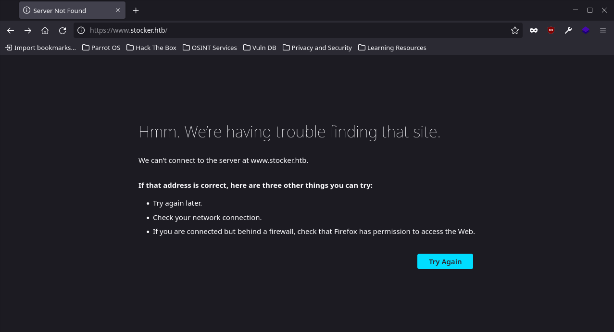
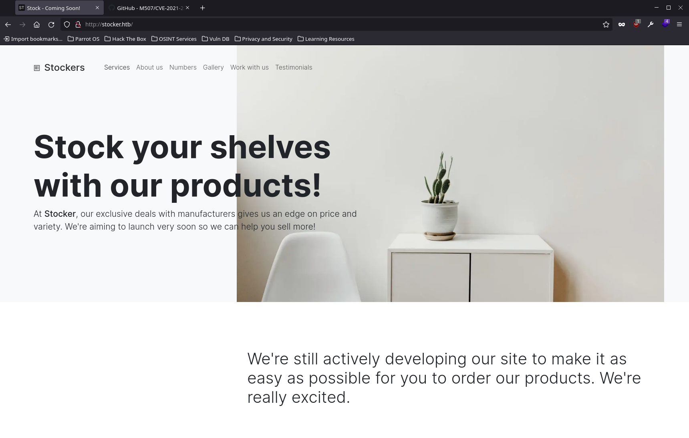

# Stocker Box

---   
**Machine IP:** 10.10.11.196   
---   

## Nmap Results
> ### nmap -sC -sV -r -p- 10.10.11.196                                                        1412ms  Tue 24 Jan 2023 04:31:13 PM CST
> Starting Nmap 7.92 ( https://nmap.org ) at 2023-01-24 16:31 CST   
> Nmap scan report for 10.10.11.196   
> Host is up (0.12s latency).   
> Not shown: 65533 closed tcp ports (conn-refused)   
> PORT   STATE SERVICE VERSION   
> 22/tcp open  ssh     OpenSSH 8.2p1 Ubuntu 4ubuntu0.5 (Ubuntu Linux; protocol 2.0)
> | ssh-hostkey: 
> |   3072 3d:12:97:1d:86:bc:16:16:83:60:8f:4f:06:e6:d5:4e (RSA)
> |   256 7c:4d:1a:78:68:ce:12:00:df:49:10:37:f9:ad:17:4f (ECDSA)
> |_  256 dd:97:80:50:a5:ba:cd:7d:55:e8:27:ed:28:fd:aa:3b (ED25519)
> 80/tcp open  http    nginx 1.18.0 (Ubuntu)
> |_http-title: Did not follow redirect to http://stocker.htb
> |_http-server-header: nginx/1.18.0 (Ubuntu)
> Service Info: OS: Linux; CPE: cpe:/o:linux:linux_kernel
> 
> Service detection performed. Please report any incorrect results at https://nmap.org/submit/ .
> Nmap done: 1 IP address (1 host up) scanned in 471.99 seconds   

  - Items of note
    - 22 is open, unlikely route of attack
    - 80 is open, running nginx

## Port 80 Enumeration

- Navigated to 10.10.11.196 and was redirected   

  - Added '10.10.11.196 stocker.htb' to host files and we get a site   
  
- Check for vulnerabilities
  - https://www.rapid7.com/db/vulnerabilities/redhat_linux-cve-2021-23017/
    - CVE-2021-23017, published 06/01/2021 listed for Red Hat linux, but host is running Ubuntu; still worth a shot
    - https://github.com/M507/CVE-2021-23017-PoC   
- Dirbusting
  - 

## Exploitation

- **CVE-2021-23017**
  - Cloned github repo listed above
  > 
